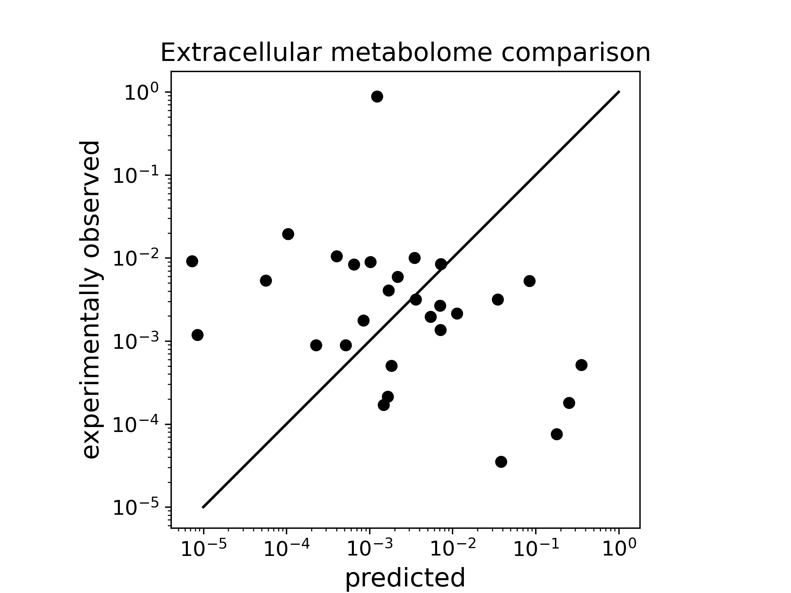
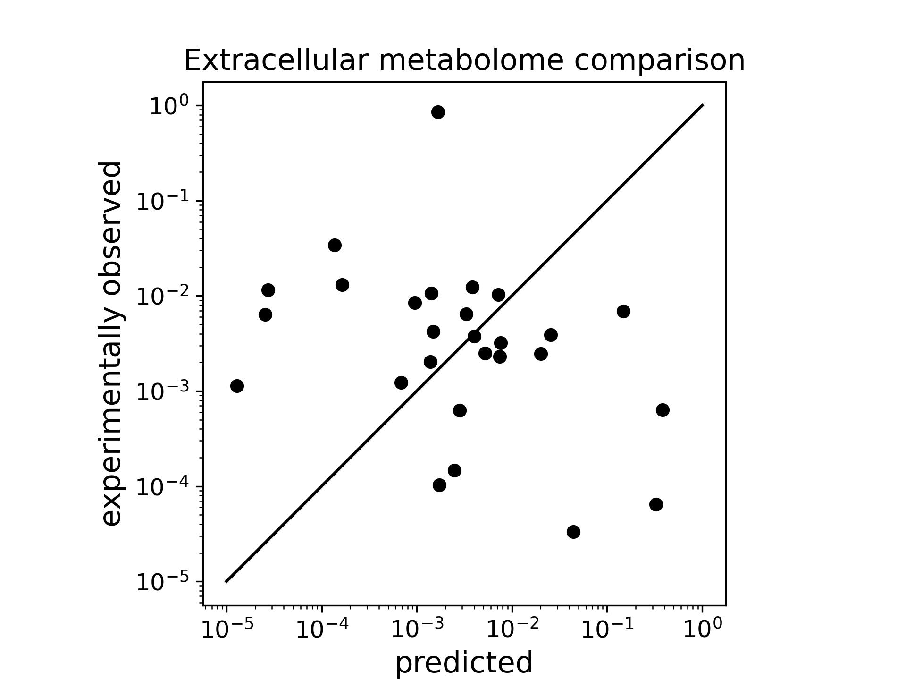

<!---------------------------
Name: cancer-cs
File: model-description
-----------------------------
Author: bvibishan
Data:   2/4/2025, 10:55:39 AM
---------------------------->
# Consumption-secretion model for cancer
The current model for cancer is based on [Akshit's previous work](https://journals.plos.org/ploscompbiol/article?id=10.1371/journal.pcbi.1007524) on trophic organisation in the human gut microbiome.

The overall goal is to build a model of metabolite consumption and secretion in cancer that can predict the minimum number of distinct cell types necessary to explain a certain extracellular metabolome profile.

## Model structure and components
- A vector of metabolite concentrations in the supplied diet
- A vector of extracellular metabolite concentrations measured at some steady state
- A vector of cell types that may differ in their uptake and secretion profiles
- A network that describes which metabolites are taken up, secreted, or both, by each cell type in the model
- Unlike in the microbiome model where the number of trophic levels was a learnt model parameter, we assume cancer communities to have only a single trophic level. We are not sure if this is an assumption we will relax later.

### Mathematical formulation
Let $A_{in}$ be an $N \times M$ binary matrix, where $N$ and $M$ are respectively the number of metabolites and cell types. $A_{in}(\alpha, i) = 1$ for every metabolite $\alpha$ that is <ins>taken up</ins> by cell type $i$, and zero everywhere else. If the concentrations of metabolites in the supplied diet is given by the vector $X$, then the net intake for cell type $i$ is given by:
```math
\text{Intake}_i = \frac{A_{in}(\alpha, i)}{\text{In-degree}}\ \frac{n_i}{\sum_{i} n_i}\ X(\alpha),
```
which indicates that the net intake for each cell type is scaled both by the number of metabolites it is capable of taking up (in degree) and its relative abundance, given by $\frac{n_i}{\sum_{i} n_i}$.

Out of this intake, we assume that each cell type secretes some fraction, $f$, hereafter called the byproduct fraction. Another binary matrix,$A_{out}$ is used to describe which cell type is capable of secreting which metabolite. As with $A_{in}$, $A_{out}(\alpha, i) = 1$ for every metabolite $\alpha$ that is <ins>secreted</ins> by cell type $i$, and zero everywhere else. The net secretion for each cell type $i$ is therefore given by:
```math
\text{Output}_i = f\ \frac{A_{out}}{\text{Out-degree}}\ \text{Intake}_i,
```
which indicates that the net secreted flux of metabolites is split equally among all the metabolites that cell type $i$ is capable of secreting (out degree). For simplicity, we assume $f$ to be the same for all cell types.

Finally, the predicted extracellular metabolome from the model is given by a combination of the metabolites secreted by cancer cells as well as the unused metabolites carried over from the supplied diet, as follows: 
```math

M_{\text{pred}} = X_{\text{unused}}\ +\ \sum_{i} \text{Output}_i,\\

\text{where}\ X_{\text{unused}} = X(\alpha)\ \forall\ A_{in}(\alpha, i) = 0,\ \text{and zero otherwise}.
```
Input$_{i}$, Output$_i$, and $M_{\text{pred}}$ are all vectors of length $\alpha$. The model uses a machine-learning algorithm to find the optimal relative frequencies of the $M$ cell types that minimises the error in $M_{\text{pred}}$. The Pearson's correlation coefficient between the predicted and measured extracellular metabolome is used to visualise the goodness of the model fit.

## Pre-requisites/knowns/assumptions:
- Supplied diet i.e., input concentrations/amounts of the metabolites
- Network that describes which metabolites are consumed/secreted/both, excluding the trivial case where all metabolites are both consumed and secreted
- Some steady-state extracellular concentration profiles of at least a subset of the supplied diet, which will be the secreted metabolome profile that the model aims to predict based by fitting the number of cells of a certain type at steady state. In the initial versions of the model, this is limited to a single cell type without changes to the underlying consumption-secretion network, but both of these will be relaxed later on.
- The model does not currently include interconversion between different metabolites, so we would usually expect that the secreted metabolome predicted by the model is likely to be largely a subset of the supplied diet. While this would be violated by metabolites that according to the network are secreted but not consumed, mass conservation should still apply. The general requirement therefore is that the total mass of the supplied diet should be equal to or greater than the mass of the secreted metabolome measured at steady state.
- The model does not include any explicit gain in biomass. So consumption in the current model means the same as uptake.

## Issues with the Immanuel et al. dataset
We have been working with GBM metabolome data from [this study by Immanuel et al.](https://www.nature.com/articles/s41540-020-00161-7), which reports extracellular concentrations in $\mu$M for a panel of 31 small metabolites, over multiple time points for two cell lines, U87MG and NSP. Initial runs of the model with relative metabolite abundances seemed to run alright, even though the model fits were quite poor for a range of values $f$ and a single cell type, without or with addition of links. The following two figures show this for the static network.

|  Figure 1: Predicted vs measured metabolomes for U87MG, single cell type, static links and $f=0.5$ |  Figure 2: Predicted vs measured metabolomes for NSP, single cell type, static links and $f=0.5$ |
| :---: | :---: |


But running the model with absolute abudances showed two things:
- Some metabolite levels were seemingly aberrant-a few readings had negative values of the metabolite concentration, while at least one metabolite, lactate, was present at surprisingly high levels; whereas other metabolites were in the $\mu$M range, lactate levels were in the mM range.
- The net mass of the supplied diet, as taken from the measured extracellular metabolome at $t=0$h was less than the net mass of the measured steady state extracellular metabolome, which was nearly 2-fold greater than that of the diet.

We don't think the authors have left any major small metabolite that could explain this imbalance in the mass flux, since their list includes almost all the amino acids, some carboxylic acids and glucose-consistent with the small metabolites in the [official composition of DMEM media](../input-data/d5030for.pdf). These facts have made us unsure of the quality of Immanuel et al.'s data, and we will therefore be looking for different datasets. These, when we find them, will be filtered based on the prerequisites mentioned above, to maintain consistent data standards.